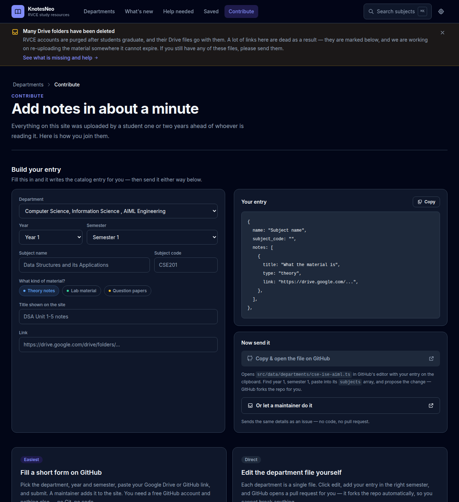

# Contributing to KnotesNeo

Everything on the site was uploaded by a student a year or two ahead of whoever
is reading it. Adding to it should take a minute — here are the two ways.



## 1. The short form (no code)

**[→ Add notes](https://github.com/Developer1010x/knotesneo/issues/new?template=add-notes.yml)**

1. Upload your files to a Google Drive folder and share it with RVCE (or push
   them to a public GitHub repo).
2. Open the form, pick the department / year / semester, paste the link.
3. Submit. A maintainer adds the entry, and your name goes on the
   [contributors page](https://developer1010x.github.io/KnotesCentral-Source-Code/contributors/).

You need a free GitHub account and nothing else. No Git, no cloning.

Broken link instead?
**[Report it](https://github.com/Developer1010x/knotesneo/issues/new?template=broken-link.yml)** —
that counts as contributing too.

## 2. Edit the department file directly

The whole catalog is plain data: one file per department under
`src/data/departments/`. Open the file for your branch on GitHub, hit the pencil
icon, and add your entry. GitHub forks the repo and opens a pull request for
you — nothing can break.

Find the right `semester`, then add to its `subjects` array:

```ts
{
  name: "Data Structures and its Applications",
  subject_code: "CSE201",
  notes: [
    {
      title: "DSA Unit 1-5 notes",
      type: "theory",          // "theory" | "lab" | "question-paper"
      link: "https://drive.google.com/drive/folders/...",
    },
  ],
}
```

Keep the shape exactly as above. The site reads these files directly, so a typo
fails the build on your pull request rather than breaking a page.

New department? Add `src/data/departments/<slug>.ts` following any existing
file, then register it in `src/data/departments/index.ts`.

Adding yourself to the contributors page: append an entry to
`src/data/contributors.ts`.

## Guidelines

- **Original content.** Submit your own work, or material you have permission to
  share.
- **Access.** Links must be openable by RVCE students — share Drive folders with
  *Anyone at RVCE with the link*.
- **Formats.** PDF, DOCX, PPTX for documents; ZIP for bundles; a public repo for
  code.
- **Quality.** Clear, organised, correctly labelled with the subject and, where
  it matters, the professor or year.

By submitting content you confirm it is yours to share, and that you are
responsible for what you submit.

## Working on the site itself

```bash
npm install
npm run dev         # http://localhost:3000
npm run check:data  # validates the catalog — run this before opening a PR
npm test            # unit tests over search, slugs, link health and the validator
npm run typecheck
npm run lint
npm run build       # prerenders every department, year, semester and subject
npm run serve       # serves the build at http://localhost:3000
```

`check:data` is the one that matters for content PRs. It catches unbalanced
braces, invalid `type` values, links missing `https://`, empty titles, and
departments missing from `index.ts` — and says how to fix each one. CI runs it
on every pull request, so a bad entry fails the check instead of shipping a
broken card.

- `src/data/` — the catalog (departments, contributors) and its types.
- `src/lib/` — lookups, search, note-type metadata, theme, site links.
- `src/components/ui/` — the shared design-system pieces.
- `src/app/` — routes; the dynamic ones prerender via `generateStaticParams`.
- `scripts/` — build-time helpers: catalog validation, PWA icons, the What's
  New dates (read from git history, so no manual changelog), and the weekly
  link checker that feeds `/gaps` and `/rot`.
- `tests/` — Vitest. `npm test` runs them; CI runs them on every pull request.

Colours are CSS custom properties in `src/app/globals.css`, exposed to Tailwind
as semantic names (`bg-surface`, `text-muted`, `border-line`, `text-brand`).
Prefer those over raw palette classes so both themes stay correct.
