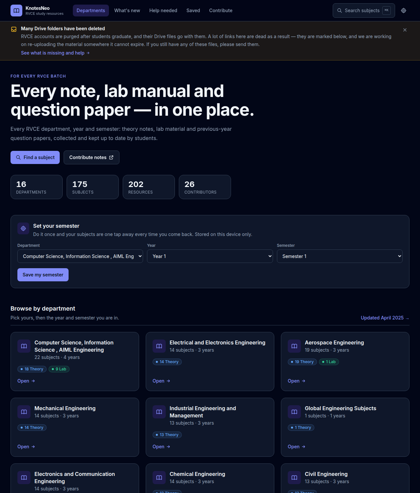
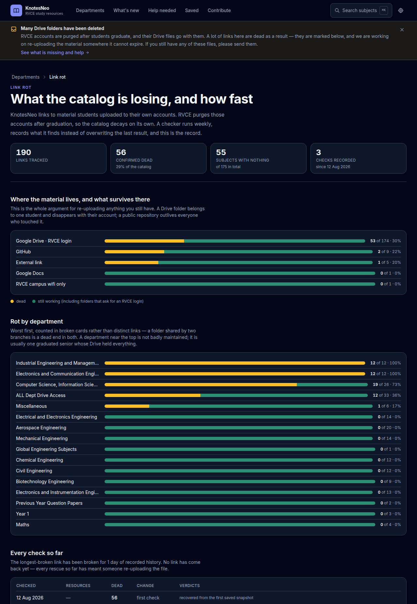
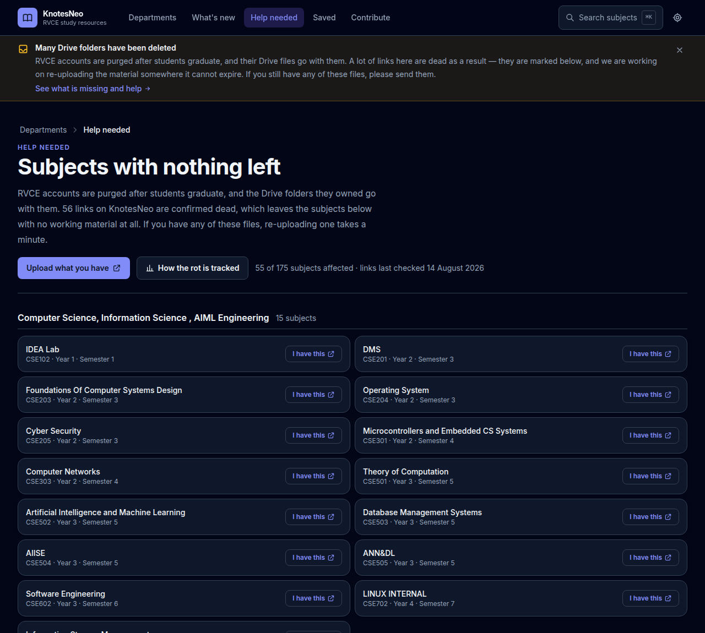
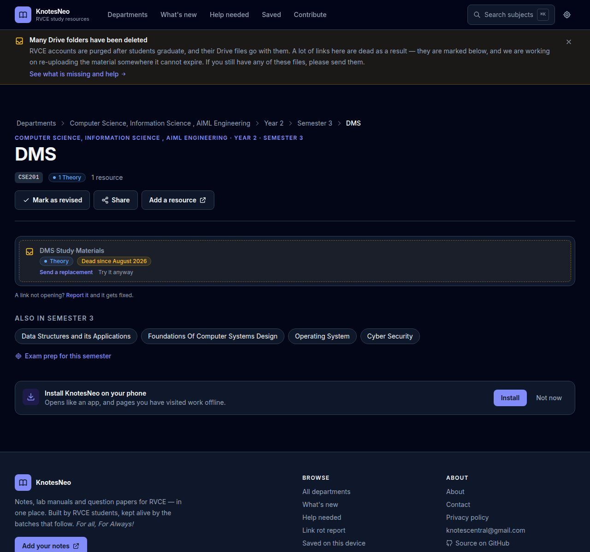
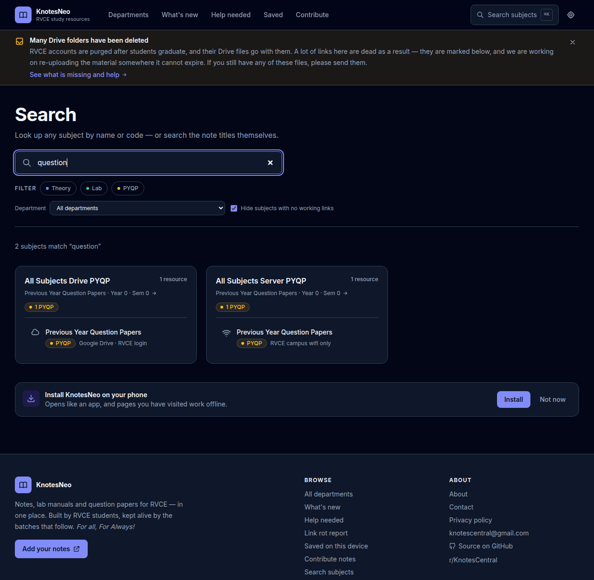

# KnotesNeo

Notes, lab manuals and previous-year question papers for RVCE — every
department, year and semester in one place, and a pipeline that measures how
fast that material is disappearing.

**Site:** <https://developer1010x.github.io/KnotesCentral-Source-Code/> —
a static export published by
[`.github/workflows/deploy.yml`](.github/workflows/deploy.yml) on every push.

**Contribute:** [add notes in about a minute](https://github.com/Developer1010x/knotesneo/issues/new?template=add-notes.yml)
· [report a broken link](https://github.com/Developer1010x/knotesneo/issues/new?template=broken-link.yml)
· [CONTRIBUTING.md](CONTRIBUTING.md)



## The problem this exists for

RVCE deletes a student's Workspace account after they graduate, and every
Google Drive folder they owned goes with it. The notes a batch collects are
therefore gone about two years after they are collected — and the site linking
to them has no way of knowing.

**56 of the 190 links in this catalog (29%) are already confirmed dead, and 55
of 175 subjects have nothing working left at all.** Those numbers are measured,
not estimated, they are on the site itself, and they are the reason the rest of
this repository is shaped the way it is.

| | |
|---|---|
|  |  |
| [`/rot`](src/app/rot/page.tsx) — what the catalog is losing, and how fast | [`/gaps`](src/app/gaps/page.tsx) — subjects with nothing working, grouped by department |

## The link-rot pipeline

This is the part worth reading the code for.

```
scripts/check-links.mjs        weekly in CI (link-check.yml), and on demand
  ├─ fetches all 190 links, classifies each one
  ├─ link-status.json          what is broken right now  → dead badges, /gaps
  └─ link-history.json         one record per run, appended → /rot
        ↓
  src/lib/linkHealth.ts        isGone / isUsable — used by every listing
  src/lib/linkRot.ts           deadSince, rot by host, rot by department
```

**Telling "deleted" apart from "needs a login" is the whole difficulty.** An
anonymous request to a Drive folder shared only with RVCE accounts looks
exactly like a request to a folder that was deleted: both answer with a sign-in
wall. Get that wrong in either direction and the site either cries wolf about
most of its own catalog, or never notices real losses.

So the checker never calls a Drive link dead on a sign-in page alone. That is
recorded as `needs-auth` — the normal, healthy state for most of this material —
and is never surfaced. Only a hard 404 from Drive (`probably-gone`) or from a
GitHub repository (`dead`) counts, which makes the published numbers a floor
rather than a guess.

Each run is appended rather than overwritten, so the site can say **"dead since
August 2026"** on the note itself, and [`/rot`](src/app/rot/page.tsx) can show
whether the rot is accelerating, which hosts survive (Drive folders die; public
repositories do not), and which departments have been hollowed out.



## What it does

- **Browse** by department → year → semester → subject, with note counts and
  coverage badges at every level, so you can see what exists before you click.
- **Search** subjects by name, code or note title — from the search page, or
  with <kbd>⌘K</kbd> / <kbd>Ctrl</kbd>+<kbd>K</kbd> anywhere on the site.
- **Filter** by material type: theory notes, lab material, question papers.



- **Know where a link goes** before opening it — Drive (RVCE login), GitHub, or
  the library server that only answers on campus wifi.
- **See what is broken**, since when, and what to send instead.
- **Set your semester once** and land on your own subjects every visit.
- **Save notes and tick off subjects** — bookmarks and revision progress, stored
  on your device, no account.
- **Exam prep view** — a whole semester's material in one list, grouped by type.
- **Installable** on Android/iOS, with offline browsing of pages you have seen.
- **What's new** feed (plus [RSS](https://developer1010x.github.io/KnotesCentral-Source-Code/feed.xml)), dated automatically from git
  history.
- [Light and dark themes](docs/screenshots/home-light.png), mobile-first
  layout, and every page prerendered as static HTML — 538 of them.

Most material lives in RVCE Workspace Drive, so you will usually need to be
signed in with your college account.

## How the catalog works

The catalog is plain TypeScript data, not a database — one file per department:

```
src/data/departments/<slug>.ts   one Department each, registered in index.ts
src/data/contributors.ts         the contributors page
src/data/types.ts                the shape everything must match
src/data/generated/              built, then committed: git dates, link verdicts
```

Adding notes means adding an object to a `subjects` array. Anyone can do it
through the GitHub editor; see [CONTRIBUTING.md](CONTRIBUTING.md). A file's name
is also its URL slug, so `maths.ts` is `/maths` — `npm test` enforces that,
because the "edit this file" button on `/contribute` is built from it.

`npm run check:data` is the gate on content pull requests. It catches unbalanced
braces, invalid `type` values, out-of-range years and semesters, links without a
scheme, empty titles and departments missing from `index.ts` — each with a
message written for someone who has never opened a terminal.

## Running it

```bash
npm install
npm run dev                  # http://localhost:3000

npm run check:data           # validate the catalog
npm test                     # 49 unit tests over the pure logic
npm run typecheck
npm run lint
npm run build                # 538 static pages into out/
npm run serve                # serve out/ at http://localhost:3000

npm run check:links          # ping every link, human-readable report
npm run check:links:write    # …and record the verdict in src/data/generated/
```

CI runs `check:data`, `test`, `typecheck`, `lint` and `build` on every pull
request. The link check runs weekly on its own schedule and commits what it
found, which is how the history in `/rot` grows.

## Deployment

The site is `output: "export"` — a directory of HTML with no server behind it.
`deploy.yml` builds it and publishes to GitHub Pages, taking both the canonical
URL and the base path from the Pages API (`actions/configure-pages`) rather than
hardcoding them, so a repository rename or a custom domain needs no code change.
The first run enables Pages by itself.

Everything that has to carry the base path does: the manifest's `start_url`, the
service worker's scope and precache list, the sitemap, the RSS feed and the
per-subject Open Graph images. `npm run build` alone (no environment) produces a
root-relative build for local use.

## Architecture, briefly

Next.js App Router + Tailwind, React 19, TypeScript strict. No backend, no
database, no runtime dependencies beyond `next` and `react`.

That is a deliberate trade. It buys free hosting, sub-second page loads, working
offline, and a catalog a non-programmer can edit through GitHub's web UI with CI
checking the result. It costs the ability to store anything: bookmarks and
progress live in `localStorage`, and **the project cannot host material, only
link to it** — which is exactly why link rot is the central problem here and not
a footnote.

- `src/data/` — the catalog (departments, contributors) and its types.
- `src/lib/` — lookups, search, link health, rot history, note metadata, theme.
- `src/components/ui/` — the shared design-system pieces.
- `src/app/` — routes; the dynamic ones prerender via `generateStaticParams`.
- `scripts/` — build-time helpers: catalog validation, PWA icons, What's New
  dates read from git history, and the link checker.
- `tests/` — Vitest over the logic that is easy to break quietly: slug
  collisions, search ranking, cross-department subject matching, the palette's
  paths, and the validator's regex parser (against fixture catalogs).

Colours are CSS custom properties in `src/app/globals.css`, exposed to Tailwind
as semantic names (`bg-surface`, `text-muted`, `border-line`, `text-brand`).
Prefer those over raw palette classes so both themes stay correct.

## Credits

- [Developer1010x](https://developer1010x.github.io/PORTFOLIO/) — V1 and the idea (S Prajwall N)
- [KTS-o7](https://kts-o7.github.io) — refactoring and updates (Krishna Tejaswi)
- Everyone on the [contributors page](https://developer1010x.github.io/KnotesCentral-Source-Code/contributors/)

Previous versions and what changed: [HISTORY.md](HISTORY.md).
